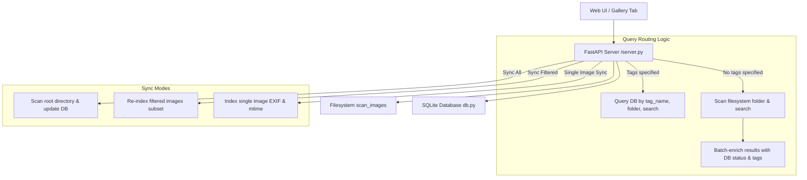

# Design Specification: Gallery Tab Refactor

**Date:** 2026-08-09  
**Status:** Approved  

---

## 1. Overview & Objectives

The Gallery Tab allows users to browse photos in their configured library, navigate folder hierarchies, filter by tags or filename patterns, view EXIF metadata, edit tags, and trigger index synchronization.

This refactor aligns gallery operations with three core principles:
1. **Filesystem-First Scoped Browsing**: When no tag filter is selected, gallery image listing and folder navigation query the physical filesystem directly so that unindexed / unprocessed images are always visible.
2. **Database Tag Search**: Filtering by tags uses SQLite database indexing for performance.
3. **Unindexed Visibility & On-Demand Syncing**: Unindexed images are visually highlighted in the grid and detail modal, with a single-click option to sync an individual image.
4. **Dual-Mode Index Syncing**: The "Sync Index" action supports both **Sync All** (full library scan) and **Sync Filtered** (re-indexing only the currently filtered subset of images).

---

## 2. Architecture & Component Changes



---

## 3. Detailed Specifications

### 3.1 Backend & Database Engine (`db.py` & `image_scanner.py`)

#### 1. Hybrid Image Listing (`get_gallery_images`)
`get_gallery_images(offset, limit, tags, search, folder, db_path, root_directory)` behaves as follows:

- **Inactive Tag Filter (`tags` is empty or None)**:
  - Scans `root_directory / folder` recursively using `scan_images()`.
  - Filters paths matching `search` (case-insensitive substring or glob pattern on `filename` / `relative_path`).
  - Sorts all matching filesystem image paths by full path name + file name (`relative_path ASC, filename ASC`).
  - Slices total matches for pagination: `offset` to `offset + limit`.
  - Batch queries SQLite `images` and `image_tags` for the paginated slice of filesystem paths.
  - Returns dictionaries formatted as:
    ```json
    {
      "id": 42 | null,
      "file_path": "/path/to/img.jpg",
      "filename": "img.jpg",
      "relative_path": "folder/img.jpg",
      "last_modified": 1723180000.0,
      "tags": ["tag1", "tag2"],
      "indexed": true | false
    }
    ```

- **Active Tag Filter (`tags` contains 1+ strings)**:
  - Queries DB table `images` JOIN `image_tags` WHERE `tag_name IN (tags)`.
  - Applies `folder` filter (`relative_path LIKE 'folder/%' OR relative_path = 'folder'`).
  - Applies `search` filter on `filename` and `relative_path`.
  - Sorts by `relative_path ASC, filename ASC`.
  - Returns paginated results with `indexed: true`.

#### 2. Single Image Indexing (`sync_single_image`)
- Function `sync_single_image(image_path_or_rel, db_path, root_directory)`:
  - Resolves path, stat mtime, reads EXIF `XPTags` using `get_existing_xptags()`.
  - Inserts/updates `images` table and `image_tags` table.
  - Returns updated dict with `indexed: true`, valid `id`, and current tags.

#### 3. Dual-Mode Index Sync (`sync_gallery_index`)
- Accepts `mode: "all" | "filtered"`, `folder`, `search`, `tags`.
- **`mode == "all"`**: Re-indexes all images under root directory.
- **`mode == "filtered"`**: Re-indexes only images matching the current filter (folder, search, tags).

---

### 3.2 Server Endpoints (`server.py`)

1. **`GET /api/gallery/images`**:
   - Accepts parameters: `offset`, `limit`, `tags`, `search`, `folder`.
   - Returns `{ "images": [...], "total": int, "offset": int, "limit": int }`.

2. **`GET /api/gallery/image/file` & `GET /api/gallery/image/{image_id}/file`**:
   - `GET /api/gallery/image/file?path=<relative_or_absolute_path>` serves raw image files directly from filesystem after path verification inside `root_directory`.
   - `GET /api/gallery/image/{image_id}/file` remains supported for backward compatibility.

3. **`POST /api/gallery/image/sync`**:
   - Body: `{ "relative_path": "..." }` or `{ "file_path": "..." }`
   - Synchronizes individual file to DB on demand.

4. **`POST /api/gallery/sync`**:
   - Body: `{ "mode": "all" | "filtered", "folder": "...", "search": "...", "tags": [...] }`
   - Starts background sync task and updates `_sync_state`.

---

### 3.3 Web UI (`webui/src`)

1. **Type Definition (`types/index.ts`)**:
   - `GalleryImage`: `{ id: number | null; filename: string; relative_path: string; file_path?: string; tags: string[]; indexed: boolean; created_at?: string; updated_at?: string; }`

2. **Thumbnail Image Loading & Unindexed Marker (`ImageCard.tsx`)**:
   - Renders image thumbnail via `/api/gallery/image/file?path=${encodeURIComponent(image.relative_path)}`.
   - If `!image.indexed`, renders:
     - Top-right overlay badge: `⚠️ Unindexed`
     - Bottom details badge: `Unprocessed`

3. **Detail Modal & On-Demand Sync (`ImageDetailModal.tsx`)**:
   - Shows file details and tags.
   - For unindexed (or indexed) images, displays an **Indexed** or **Unindexed** status badge and a **"Sync Image"** button.
   - Clicking "Sync Image" calls `POST /api/gallery/image/sync`, updates modal image state to `indexed: true`, updates tags, and refreshes the gallery.

4. **Sync Index Dual-Mode Control (`GalleryTab.tsx` / `GalleryToolbar.tsx`)**:
   - Provides a split button or dropdown menu:
     - **Sync All**: Re-indexes all files under root.
     - **Sync Filtered**: Re-indexes only images matching the current folder, search, or tag filter.

---

## 4. Error Handling & Edge Cases

- **Non-existent or moved files**: If a file path returned by filesystem scan disappears before image serving, return HTTP 404 cleanly.
- **Malformed glob patterns**: Fallback safely to substring search if glob compilation fails.
- **Permission errors during filesystem walk**: Log warnings and skip unreadable directories/files without crashing the API.

---

## 5. Verification & Testing Strategy

1. **Unit & API Tests**:
   - Test `get_gallery_images()` with unindexed files on disk (verify `indexed: false` and `id: null`).
   - Test `get_gallery_images()` with active tag filters (verify DB tag lookup).
   - Test `sync_single_image()` endpoint and DB insertion.
   - Test `sync_gallery_index()` in both `"all"` and `"filtered"` modes.
2. **Frontend Component & Integration Validation**:
   - Build frontend assets (`npm run build` or `vite build`) to verify TypeScript type compliance.
   - Verify all 160+ unit tests pass cleanly in pytest.
